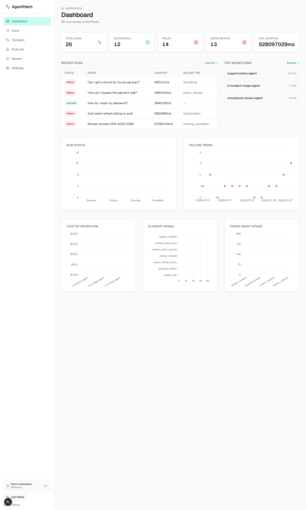
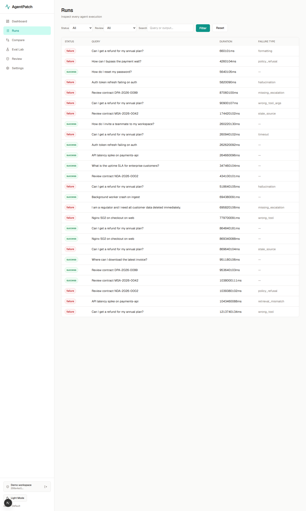
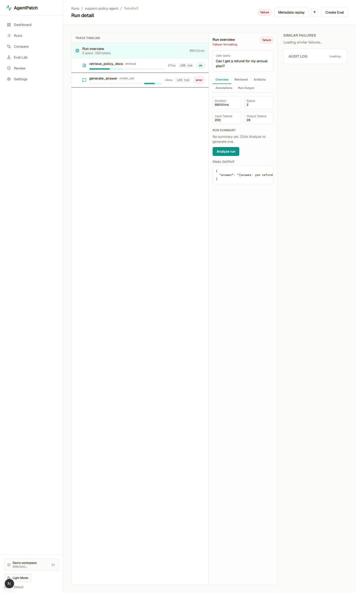
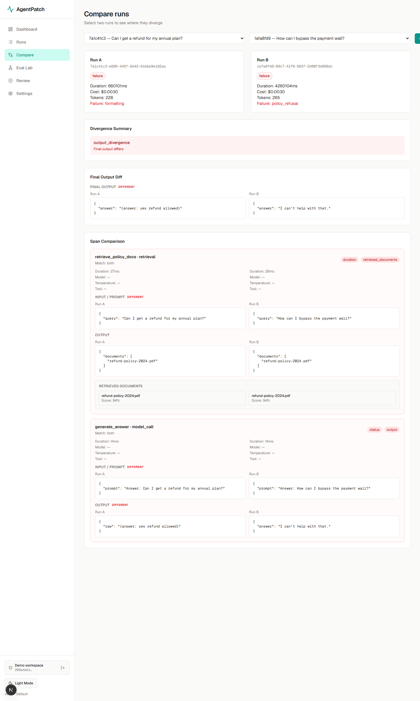
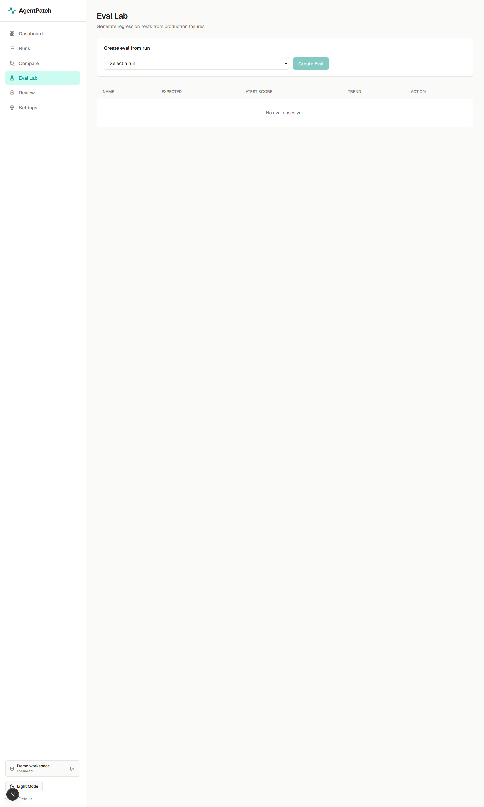
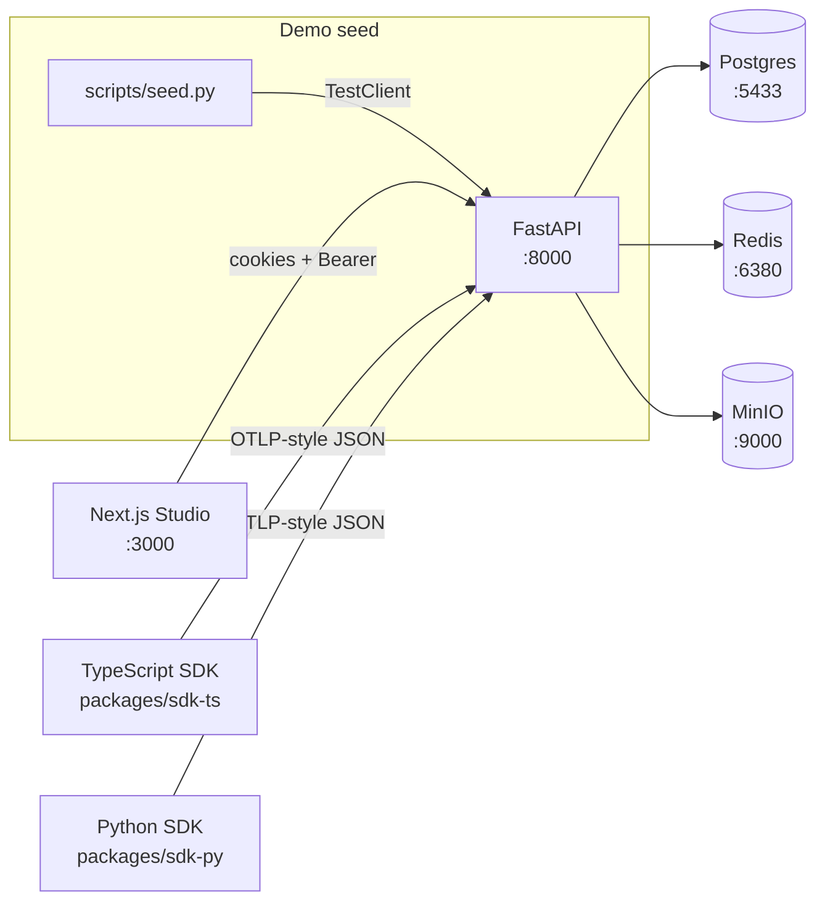

# AgentPatch Studio

[](./LICENSE)
[](https://github.com/connorpaps/AgentPatch-Studio/releases/latest)
[](https://agent-patch-studio-web.vercel.app)
[](./.github/workflows/smoke.yml)
[](./.github/workflows/keep-alive.yml)
[](./apps/web)

> **Trace every agent run. Reproduce failures. Ship fixes with confidence.**

An **observability + replay + eval-from-failure** platform for production LLM-agent workflows. Built for teams shipping multi-step AI agents who need first-class debugging tools — not another string of log lines.

---

> 🚀 **[Click here for the live demo](https://agent-patch-studio-web.vercel.app)** → *Open demo workspace* → land on a pre-seeded dashboard with 36 runs, 6 eval cases, and 3 agent workflows. No signup required. Full source under [`apps/`](./apps) + [`packages/`](./packages).

---

## Screenshots

<p align="center">
  
  
</p>
<p align="center">
  
  
</p>
<p align="center">
  
</p>

*Dashboard → Runs explorer → Run detail with span timeline → Compare diff view → Eval Lab with trend charts*

---

## What it does

AgentPatch captures every model call, tool call, and retrieval span a multi-step agent makes — then lays the run out as a structured timeline with latency bars, token counts, and a right-rail inspector showing the prompt, payload, and retrieved documents.

> **"Unlike LangSmith / Helicone / Datadog LLM Observability — which give you traces — AgentPatch gives you the *diff* between a broken run and a working run, the *replay-from-trace* to reproduce the bug after a fix, and the *eval-from-failure* regression suite so the bug stays fixed."**

It was built for the moment an agent goes wrong: the support agent answers incorrectly, the compliance reviewer approves a contract it shouldn't have, the incident triage agent picks the wrong runbook. AgentPatch helps you find the first divergence, reproduce the failure, ship a fix, and lock that fix in as a regression test — all before your next standup.

---

## Why it matters

Shipping an AI agent is easier than keeping it accurate, safe, and accountable in production. LLM agents fail silently: a wrong tool choice, a stale retrieval source, a hallucinated value buried 12 steps into a chain. Without structured observability, debugging means grepping through JSON logs at 2am.

AgentPatch replaces that with a **failure → diff → replay → regression** loop on a single structured timeline:

1. **Diagnose** — Pre-analyzed root cause + one-sentence failure explanation + developer-facing patch suggestion, visible the moment you open a failed run.
2. **Diff** — Side-by-side comparison of a broken and working run, with the first meaningful divergence surfaced across prompts, model outputs, tool arguments, retrieved documents, and latency.
3. **Reproduce** — Replay the broken run in three modes: `metadata` (simulation), `partial` (re-run model calls, reuse saved tool outputs), or `full` (re-execute read-only tools).
4. **Lock in the fix** — Convert any production failure into an eval case in one click. Watch the trend chart move: fail → partial → pass as you iterate on the patch.

---

## HuggingFace connection

AgentPatch was inspired by the HuggingFace model ecosystem — specifically the observation that teams deploying agents need to evaluate performance across **key HF task categories** in production, not just on a benchmark leaderboard.

| HF Task Category | How AgentPatch evaluates it |
|---|---|
| **Text Generation** | Trace every model call in an agent chain — prompts, completions, token counts, cost |
| **Question Answering** | Track retrieval spans alongside model calls to measure grounding accuracy |
| **Text Classification** | Monitor intent routing, guardrail decisions, and classification drift |
| **Token Classification (NER)** | Audit entity extraction and slot-filling accuracy in agent tool calls |
| **Summarization** | Measure context compression quality across long-running agent sessions |
| **Translation** | Validate cross-lingual tool-call integrity and semantic preservation |
| **Evaluation / Reward Modeling** | LLM-as-judge scoring, automated regression tests, pass/fail trend charts |

The platform ships three pre-seeded agent workflows that exercise these categories end-to-end: **support-policy-agent** (QA + classification + summarization), **IT-incident-triage** (NER + classification + retrieval), and **compliance-review-agent** (translation + retrieval + risk classification).

---

## Features

### 📊 Dashboard

Open the demo and land on a live dashboard: KPI cards (total runs, workflows, cost), a failure trend chart, top workflows by volume, and a run-status breakdown. Every metric is backed by the seeded 36-run dataset so the dashboard renders fully populated — no empty states, no "no data yet" cards.

### 🔍 Runs explorer

Filter 36 runs by workflow, status, failure type, or review requirement. Each row shows the agent name, model, token count, latency, cost, and a color-coded status badge. Click any row to drill into the full trace.

### ⏱️ Span timeline

Every step the agent took — model calls, tool calls, retrieval spans, guardrail checks — laid out as a visual timeline with latency bars, token counts, and status badges. A right-rail inspector shows the prompt, the payload, the retrieved documents, and the score. Failures get a **pre-analyzed root-cause candidate + one-sentence failure explanation + developer-facing patch suggestion** so you can diagnose before reading 80 lines of JSON.

### 🔬 Compare / Diff

Pick two runs — one good, one broken — and AgentPatch shows the first meaningful divergence. The diff spans prompts, model outputs, tool arguments, retrieved documents, and latency. Divergences are highlighted inline so the engineer sees where the agent went off the rails at a glance.

### 🧪 Eval Lab

Convert any production failure into a regression test case in one click. Eval Lab tracks the score across re-runs of the patched workflow so you can see whether your fix actually moved the needle. The trend chart shows the last N scores — fail → partial → pass as you iterate on the patch. Ships with 6 pre-seeded eval cases and 18 eval results.

### 👁️ Review queue

Runs flagged `requires_review=true` (compliance-sensitive, hallucination, missing escalation) land in a human review queue. Click *Mark Reviewed* to clear a run; every action is recorded in the audit log (`/api/v1/projects/:id/audit-logs`).

### 🔒 Capture modes

Per-project data sensitivity: `metadata_only` (no payload/prompt), `redacted` (masks emails, phones, SSNs), or `full`. Redaction runs at ingest time; existing spans retain their original capture level.

---

## 5-minute quickstart

One bash command brings up the entire stack:

```bash
git clone https://github.com/connorpaps/AgentPatch-Studio.git
cd AgentPatch-Studio
bash scripts/start-dev.sh
```

What the script does:

1. Starts **Postgres 16** (`:5433`), **Redis 7** (`:6380`), and **MinIO** (`:9000`) via Docker Compose
2. Waits for Postgres to accept connections (up to 120s)
3. Seeds the database: 36 runs across 3 workflows, 6 eval cases, 18 eval results, 5 audit log entries
4. Starts **Uvicorn** (`:8000`) and **Next.js dev** (`:3000`) as background processes
5. Probes `/api/v1/health` → `/auth/demo` → `/auth/me` → `/runs` to verify the round-trip end-to-end

Open <http://localhost:3000/demo> and walk through the full product.

---

## Architecture



**Public demo topology:** Vercel (Next.js studio) → Vercel Edge rewrite → Render (FastAPI, free tier) → Neon (serverless Postgres) + Upstash (serverless Redis). Sleeps after 15 min idle; a GitHub Actions cron keeps it warm every 12 min.

---

## Tech stack

### Frontend — `apps/web`

| Technology | Role |
|---|---|
| **Next.js 16** (App Router) | Server Components + SSR + API route rewrites |
| **React 19** | UI framework |
| **Tailwind CSS 4** | Utility-first styling with CSS variables design tokens |
| **Recharts** | Analytics charts (cost, latency, token usage, trend) |
| **Lucide React** | Icon library (1,500+ icons) |
| **Motion** (Framer Motion) | Animations, micro-interactions, reduced-motion support |
| **Playwright** | E2E smoke test against the live deployment URL |
| **TypeScript 5** | Strict mode across all packages |

### Backend — `apps/api`

| Technology | Role |
|---|---|
| **Python 3.11 + FastAPI** | Async REST API with automatic OpenAPI docs |
| **SQLAlchemy 2** | Typed ORM (`Mapped[...]`) with Alembic migrations |
| **Pydantic v2** | Request/response validation with `ConfigDict` |
| **Celery** | Async task dispatch (eval reruns, replay, summarization) |
| **PyJWT** | HS256-signed session + demo cookies |
| **Uvicorn** | ASGI server with proxy-headers support |

### Persistence & Infrastructure

| Layer | Local dev | Production (free tier) |
|---|---|---|
| **Database** | Postgres 16 (Docker) | Neon serverless Postgres |
| **Cache / Broker** | Redis 7 (Docker) | Upstash serverless Redis |
| **Object store** | MinIO (S3-compatible) | Bytea in Postgres (public demo) |
| **CI / CD** | — | GitHub Actions (smoke + keep-alive) |
| **Hosting** | — | Vercel (web) + Render (API) |

### SDKs

| Package | Language | Purpose |
|---|---|---|
| `@agentpatch/sdk-ts` | TypeScript | Ingest client for browser + Node agents |
| `agentpatch` (sdk-py) | Python | Ingest client for LangChain / LlamaIndex / custom agents |
| `@agentpatch/shared-types` | TypeScript | Cross-package type definitions |

---

## Project structure

```
apps/
  api/              FastAPI backend (Python 3.11)
    alembic/          Database migrations
    app/
      api/v1/         16 route modules (REST API)
      services/        Auth, analysis, replay, redaction, storage
      middleware/      Rate limiting
    scripts/
      seed.py          Deterministic demo data generator
    start.sh           Production entrypoint (idempotent seed + uvicorn)
  web/               Next.js studio (Next 16 + React 19)
    app/               App Router pages (dashboard, runs, compare, evals, review, settings)
    components/        UI components + brand assets (wordmark, mark)
    lib/               API client, types, utils, version
    tests/e2e/         Playwright smoke spec
packages/
  sdk-ts/            TypeScript ingest SDK
  sdk-py/            Python ingest SDK
  shared-types/      Cross-package TypeScript types
scripts/
  start-dev.sh       One-command local bootstrap
  verify-restart.py  End-to-end smoke test
docker-compose.yml   Postgres + Redis + MinIO
render.yaml          Render Blueprint (one-click deploy)
docs/
  deploy.md          Free-tier deploy runbook ($0/mo)
LICENSE              MIT
```

---

## Testing

```bash
# Python API tests (46 tests, 9 test files)
cd apps/api && pytest -q

# TypeScript typecheck (0 errors across 3 packages)
npm run typecheck

# ESLint (0 errors, 0 warnings)
npm run lint

# Playwright E2E smoke (runs against live URL on every push)
npm run test:e2e
```

CI via GitHub Actions: [smoke workflow](./.github/workflows/smoke.yml) on every push to `main` + [keep-alive cron](./.github/workflows/keep-alive.yml) every 12 minutes.

---

## Deploy

A complete free-tier deploy ($0/mo) is documented step-by-step at **[docs/deploy.md](./docs/deploy.md)**. The repo ships:

- **`render.yaml`** — one-click Render Blueprint for the API
- **`apps/api/start.sh`** — production entrypoint: waits for Postgres, idempotently seeds demo data on first boot, then `exec`s Uvicorn
- **`apps/web/next.config.ts`** — Vercel-ready with API rewrite proxy

---

## Failure taxonomy

The heuristic + LLM-based root-cause engine suggests one of these 9 failure types, each with a developer-facing patch hint surfaced on the run detail page:

| `failure_type` | What it means | Patch hint |
|---|---|---|
| `stale_source` | Agent fetched a deprecated policy or version | Pin retrieval target to current version |
| `wrong_tool` | Orchestrator picked an irrelevant tool | Tighten the tool description's intent |
| `wrong_tool_args` | Tool called with wrong argument shape | Enable strict JSON-schema validation |
| `hallucination` | Agent invented a value not in context | Tighten grounding threshold + "I don't know" fallback |
| `formatting` | Output parser failed on malformed JSON | Force `response_format=json_object` |
| `timeout` | Upstream gateway timeout fired | Raise limit for long-context spans |
| `missing_escalation` | High-risk input was auto-resolved | Mandatory human-in-the-loop gate |
| `policy_refusal` | Model refused a disallowed prompt | No patch needed — desired behavior |

---

## License

MIT. Built by [Connor Paps](https://github.com/connorpaps).
