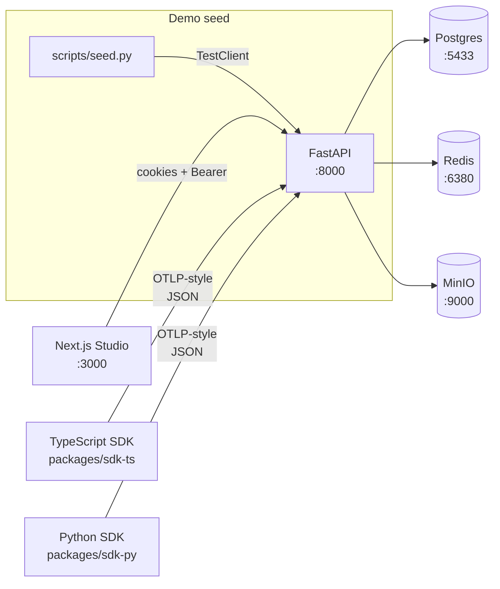

# AgentPatch Studio

**Trace every agent run. Reproduce failures. Ship fixes with confidence.**

An observability + replay + eval-from-failure platform for production LLM-agent workflows. Built for teams shipping multi-step agents who need first-class debugging tools instead of string-of-log-lines.

> **Live demo:** [agent-patch-studio-web.vercel.app](https://agent-patch-studio-web.vercel.app) — hosted on Vercel + Render (free tier); click *Open demo workspace* to mint a session. The smoke test ([.github/workflows/smoke.yml](./.github/workflows/smoke.yml)) runs against this URL on every push to `main`. See [Deploy](#deploy) below for the runbook.

---

> One workspace · 36 seeded runs · 6 eval cases · 18 eval results · 3 demo workflows · bring it up locally with one command.

---

## What it does

AgentPatch is an agent-execution tracing, replay-from-trace, side-by-side diffing, and eval-from-failure platform. The pitch in one sentence:

> **Unlike LangSmith / Helicone / Datadog LLM Observability — which give you traces — AgentPatch also gives you the diff between a broken run and a working run, the replay-from-trace to reproduce the bug after a fix, and the eval-from-failure regression suite so the bug stays fixed.**

It was built for the moment an agent goes wrong: the support agent answers incorrectly, the compliance reviewer approves a contract it shouldn't have, the incident triage agent picks the wrong runbook. AgentPatch captures every model call and tool call, shows the failure as a structured timeline, helps you locate where it diverged, and lets you convert the failure into a regression test before you ship a fix.

## Why it matters in 2026

Teams are discovering that shipping an AI agent is easier than keeping it accurate, safe, observable, and accountable in production. Observability, evaluation, governance, and tool-call tracing are major priorities in the current agent engineering stack. AgentPatch is the tools those teams need — built around the workflow of an on-call engineer debugging an agent at 2am, not around a graph full of p99 latency lines.

---

## Deploy

A free-tier public-URL deploy is documented step-by-step at **[docs/deploy.md](./docs/deploy.md)** (Vercel + Render + Neon + Upstash, $0/mo). The repo ships `render.yaml` for a one-click Blueprint deploy on Render, plus `apps/api/start.sh` as the production entrypoint that waits for Postgres, idempotently seeds the demo data on first boot, then execs uvicorn.

## 5-minute quickstart

The whole stack is one bash command — Postgres + Redis + MinIO via Docker Compose, then the API + web dev server with a 3-step readiness probe:

```bash
git clone https://github.com/connorpaps/AgentPatch-Studio.git
cd AgentPatch-Studio
bash scripts/start-dev.sh
```

What the script does:

1. Brings up Postgres (port `5433`), Redis (`6380`), and MinIO (`9000`) in Docker Compose.
2. Waits for Postgres to accept connections (up to 120s).
3. Runs `apps/api/scripts/seed.py` — drops + recreates all tables + seeds 36 runs across 3 workflows + 6 eval cases + 18 eval results + 5 audit log entries.
4. Starts uvicorn (`:8000`) and `next dev` (`:3000`) as background processes; writes their PIDs to `api.pid` / `web.pid`.
5. Probes `/api/v1/health` → `/auth/demo` → `/auth/me` → `/runs?limit=1` to prove the demo cookie + seeded data round-trip end-to-end.

Open <http://localhost:3000/demo> and walk through:

```
1. curl http://localhost:8000/api/v1/health                          ← Postgres + Redis status
2. curl -X POST http://localhost:8000/api/v1/auth/demo               ← mint a demo session
3. open  http://localhost:3000/demo                                 ← Next.js demo workspace
```

## See it in action

### Trace every run


The Runs page is the project's table of contents — every agent execution ever, filterable by workflow / status / failure type / requirement-for-review. Click any row to drill into the trace.### Inspect the timeline of one run


Every step the agent took — model calls, tool calls, retrieval spans, ground-truth checks — laid out as a visual timeline with latency bars, token counts, status badges, and a right-hand inspector with the prompt, the payload, the retrieved documents, and the score. Failures get **a pre-analyzed root-cause candidate + a one-sentence failure explanation + a developer-facing patch suggestion** so you can diagnose before you have to read 80 lines of JSON.### Side-by-side diff


Pick two runs — usually one good, one broken — and AgentPatch shows you the first meaningful divergence: which prompt version, which retrieved document, which model output, which tool argument, which latency step changed. The diff view highlights divergences with a small red callout above each divergent span.### Eval from failure


Convert any production failure into a regression test case in one click. Eval Lab tracks the score across runs of the patched workflow so you can see whether your fix actually moved the needle. The trend chart on each case shows the last N scores — fail → partial → pass as you iterate on the patch.

### Real-time review queue

Runs flagged `requires_review=true` (compliance-sensitive, hallucination, missing escalation) land in the human review queue. Click *Mark Reviewed* to remove from queue; the action is recorded in the audit log (visible via `/api/v1/projects/:id/audit-logs`). This is the smallest additional workflow surface a compliance team needs to gate risky agent behavior.

---

## Architecture



The SDKs are the canonical integration path — instrumenting an agent is a matter of `new AgentPatch({ baseUrl, apiKey, workflowName })` then wrapping calls with `startRun() / startSpan() / recordRetrieval() / recordArtifact()`. Optional OTLP-style ingest (`POST /api/v1/ingest/otlp`) is wired for adapters.

---

## Tech stack

### Front end — `apps/web`

- **Next.js 16** (App Router) + **React 19**
- **Tailwind 4** + **`recharts`** for analytics
- **`lucide-react`** icon library
- **Playwright** (smoke test committed; runs against the live URL on the optional GitHub Actions workflow at [`.github/workflows/smoke.yml`](./.github/workflows/smoke.yml))
- Server components render KPI cards + tables server-side; interactive surfaces (`"use client"` components) handle mutations, filters, and run-detail drilldowns.
- One-command prod build: `npm install && npm run build` (Vercel picks this up automatically on push to `main`).

### Back end — `apps/api`

- **Python 3.11** + **FastAPI 0.110+** with **Uvicorn**
- **SQLAlchemy 2** (typed `Mapped[...]` ORM) + **Alembic** migrations
- **Pydantic v2** with `ConfigDict(...)` (no bare `class Config`)
- **Celery** scaffolding for async eval reruns + replays (eager mode in dev)
- Redaction service (`apps/api/app/services/redaction.py`) honors `Project.capture_mode` (`metadata_only` / `redacted` / `full`)
- Production entrypoint is `apps/api/start.sh`: waits for Postgres, idempotently seeds demo data on first boot (only when `runs` table is empty), then `exec` Uvicorn so SIGTERM reaches it for graceful shutdown on Render's free-tier spin-down.

### Persistence

| Layer | Local dev (`docker-compose.yml`) | Production (free-tier deploy) |
|---|---|---|
| Relational DB | **Postgres 16** (host `:5433` → container `:5432`) | **[Neon](https://neon.tech)** serverless Postgres (free tier, native TLS, branches) |
| Cache / broker | **Redis 7** (host `:6380` → container `:6379`) | **[Upstash](https://upstash.com)** serverless Redis (free tier, `rediss://` protocol) |
| Object store | **MinIO** (host `:9000`, console `:9001`) — S3-compatible blob storage for artifact payloads | _Not used in the public demo deploy — artifacts are bytea in Postgres_ |
| Worker runtime | Celery eager mode (sync) | Celery scaffolded but not started; replay/eval-async paths use inline eager mode |

### SDKs

- **`packages/sdk-ts`** — `@agentpatch/sdk` — TypeScript ingest client for browser + Node agents
- **`packages/sdk-py`** — `agentpatch` — Python ingest client for LangChain / LlamaIndex / custom agents
- **`packages/shared-types`** — cross-package TypeScript types (`RunRecord`, `SpanRecord`, `EvalCaseRecord`, `CaptureEvent`, `ReplayMode`, etc.) consumed by both the SDK and the Next.js front end

---

## What's in the repo

```
apps/
  api/             FastAPI service (Python 3.11)
    -> start.sh           Production entrypoint: waits for DB, idempotent seed, exec uvicorn
  web/             Next.js studio (Next 16 + React 19)
    -> playwright.config.ts    Smoke-test config (targets the live URL by default)
    -> tests/e2e/              Playwright smoke spec — first-visit + demo journey
packages/
  sdk-ts/          @agentpatch/sdk — TypeScript ingest SDK
  sdk-py/          agentpatch — Python ingest SDK
  shared-types/    Cross-package TypeScript types
scripts/
  start-dev.sh     One-command local bootstrap (Postgres + Redis + MinIO + seed)
  verify-restart.py  End-to-end smoke test after a restart
docker-compose.yml    Postgres + Redis + MinIO stack for local dev
render.yaml            Render Blueprint — one-click API deploy
.github/workflows/    CI: optional daily + on-push Playwright smoke test
docs/deploy.md        Free-tier deploy runbook (Vercel + Render + Neon + Upstash)
LICENSE               MIT
```

---

## What you can do with it

- **Ingest** runs + spans + tool calls + retrievals + artifacts through the TypeScript/Python SDK or the raw REST API.
- **Inspect** a run as a structured visual timeline of prompts, model calls, retrieved documents, tool calls, outputs, costs, and latency. Every run ships pre-analyzed so the failure explanation + patch suggestion are visible without a click.
- **Compare** two runs side-by-side and see the first meaningful divergence — prompt, model, document set, tool sequence.
- **Replay** a broken run in `metadata` (show the original simulation), `partial` (re-run model calls while reusing saved tool outputs / retrieved documents), or `full` mode.
- **Tag** the failure root cause from a standardized taxonomy (`stale_source`, `wrong_tool`, `wrong_tool_args`, `hallucination`, `formatting`, `timeout`, `missing_escalation`, `policy_refusal`).
- **Convert** a failure into an eval case and watch the score trend fail → partial → pass as you iterate on patches.
- **Review** runs flagged `requires_review=true` and let the audit log capture the action.

---

## Failure taxonomy

The heuristic + LLM-based root-cause engine (`apps/api/app/services/analysis.py`) suggests one of these:

| `failure_type` | What it means | Pre-analysis patch hint |
|---|---|---|
| `stale_source` | Agent fetched a deprecated policy/version | Pin retrieval target to current version |
| `wrong_tool` | Orchestrator picked an irrelevant tool | Tighten the tool description's intent |
| `wrong_tool_args` | Tool called with the wrong argument shape | Enable strict JSON-schema validation |
| `hallucination` | Agent invented a specific value not in retrieved context | Tighten grounding threshold + "I don't know" fallback |
| `formatting` | Output parser failed on malformed JSON | Force `response_format=json_object` |
| `timeout` | Upstream gateway 30s timeout fired | Raise to 60s for long-context spans |
| `missing_escalation` | High-risk input was auto-resolved | Mandatory human-in-the-loop gate |
| `policy_refusal` | Model refused a disallowed prompt | No patch needed — desired behavior |

---

## Run the tests

```bash
cd apps/api
pytest -q
```

```bash
npm run typecheck  # 0 errors across @agentpatch/shared-types + @agentpatch/sdk-ts
```

---

## License

MIT.

---

Built by [Connor Paps](https://github.com/connorpaps). [Demo data](#what-it-does) is seeded deterministically from `apps/api/scripts/seed.py`; bring up local Postgres + Redis + MinIO with `bash scripts/start-dev.sh` to reproduce.
